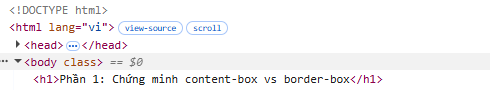
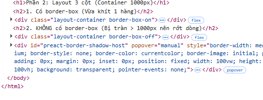

# Bài B2: Box Model Lab

### Phần 1 — Chứng minh content-box vs border-box

- **Hộp 1 (content-box):** chiều rộng thực tế = **350px** (đo từ DevTools)
  
  

- **Hộp 2 (border-box):** chiều rộng thực tế = **300px** (đo từ DevTools)

  

**Giải thích sự khác biệt:**
- Đối với **Hộp 1 (content-box)**: Trình duyệt mặc định hiểu `width: 300px` chỉ là kích thước của phần lõi chứa text bên trong. Khi em set thêm padding (20px * 2) và border (5px * 2), nó sẽ cộng dồn tịnh tiến ra ngoài. Tính ra là: 300 + 40 + 10 = 350px. Do đó cái hộp bị phình to ra.
- Đối với **Hộp 2 (border-box)**: Thuộc tính này sẽ bắt trình duyệt phải ép toàn bộ padding và border lọt thỏm vào bên trong cái `width: 300px` ban đầu. Tổng kích thước hộp bị khóa chết ở 300px, lúc này phần lõi chữ bên trong tự động bị bóp hẹp lại nhường chỗ cho lề.

---

### Phần 2 — Layout 3 cột

Nếu KHÔNG dùng `border-box` (tức là để mặc định `content-box`), kích thước thực tế của từng cột sẽ bị độn thêm padding:
- Cột trái (sidebar): 250px + 15px (trái) + 15px (phải) = **280px**
- Cột giữa (content): 500px + 20px (trái) + 20px (phải) = **540px**
- Cột phải (ads): 250px + 15px (trái) + 15px (phải) = **280px**

**Tổng 3 cột:** 280 + 540 + 280 = **1100px**

**Kết luận:** 
Vì 1100px lớn hơn hẳn chiều rộng 1000px của thẻ container bọc bên ngoài, nên layout sẽ bị vỡ vụn. Cụ thể là cột thứ 3 bên phải không đủ chỗ đứng nên sẽ bị rớt xuống dòng dưới. Chỉ khi xài `border-box`, cả 3 cột mới gom lại đúng 1000px và nằm vừa khít trên cùng 1 hàng.

