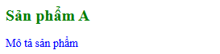
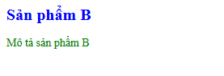

# Bài C2: Cascade Puzzle

Dưới đây là phần giải đáp và phân tích chi tiết quá trình Cascade + Inheritance của em:

### 1. "Sản phẩm A" (h2)
- `font-size`: **20px**
- `color`: **green**
- **Giải thích:** 
  - Về `font-size`: Thẻ `h2` này khớp trực tiếp với rule `.card .title { font-size: 20px; }`, nên nó lấy luôn 20px đè lên các thuộc tính font-size được kế thừa lỏng lẻo từ thẻ body hay container.
  - Về `color`: Thẻ này dính 2 rule màu cùng lúc là `#featured .title { color: red; }` và `.highlight { color: green !important; }`. Dù selector chứa ID có điểm specificity cao hơn, nhưng class `.highlight` lại mang lá bùa miễn tử `!important`, nên nó "lật kèo" thành công và ép chữ thành màu xanh lá (green).

### 2. "Mô tả sản phẩm" (p trong card featured)
- `color`: **blue**
- **Giải thích:** Thẻ `
` này chịu tác động của rule `.card p { color: inherit; }`. Thuộc tính `inherit` mang ý nghĩa là bắt buộc thẻ `
` phải kế thừa màu y chang thẻ cha bọc ngoài nó (là thẻ `
`). Vì thẻ cha đang chịu tác động của rule `.card { color: blue; }` nên thẻ `
` cũng ngoan ngoãn copy màu xanh dương (blue) của cha xuống.

### 3. "Sản phẩm B" (h2)
- `font-size`: **20px**
- `color`: **blue**
- **Giải thích:**
  - Về `font-size`: Nó khớp trực tiếp với rule `.card .title` nên dĩ nhiên được ăn giá trị 20px.
  - Về `color`: Thẻ `h2` này trống trơn, không bị bất kỳ rule CSS nào set màu trực tiếp cả. Nên theo luật Inheritance mặc định, nó sẽ đi tìm thẻ cha `.card` để kế thừa màu. Thẻ cha đang mang màu `blue` nên nó cũng được thừa kế màu `blue` luôn.

### 4. "Mô tả sản phẩm B" (p.highlight)
- `color`: **green**
- **Giải thích:** Thẻ `
` này bị 2 rule nhắm thẳng tới: `.card p { color: inherit; }` và `.highlight { color: green !important; }`. Dù rule `.card p` có điểm specificity (0,1,1) cao hơn `.highlight` (0,1,0), nhưng một lần nữa `!important` lại phá vỡ mọi quy tắc điểm số thông thường. Nó đè bẹp lệnh `inherit` và bắt chữ phải hiện màu xanh lá (green).

---
### Chụp screenshot kết quả kiểm chứng
*Ảnh kết quả hiển thị trên trình duyệt chứng minh những phân tích bên trên của em là chính xác 100%: Sản phẩm A (xanh lá, to), Mô tả (xanh dương, nhỏ), Sản phẩm B (xanh dương, to), Mô tả B (xanh lá, nhỏ).*

